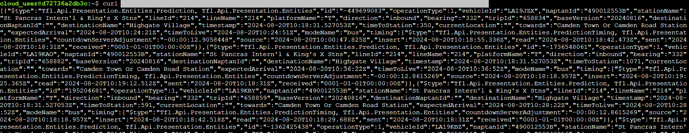
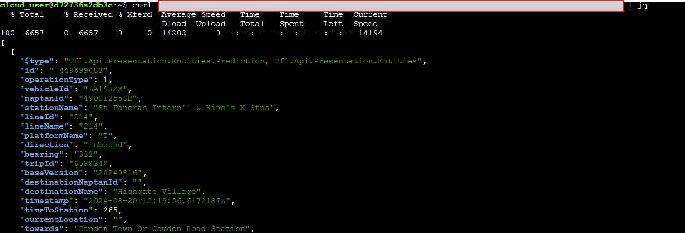
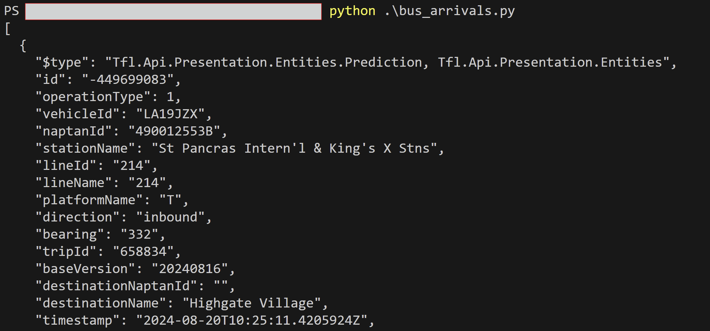
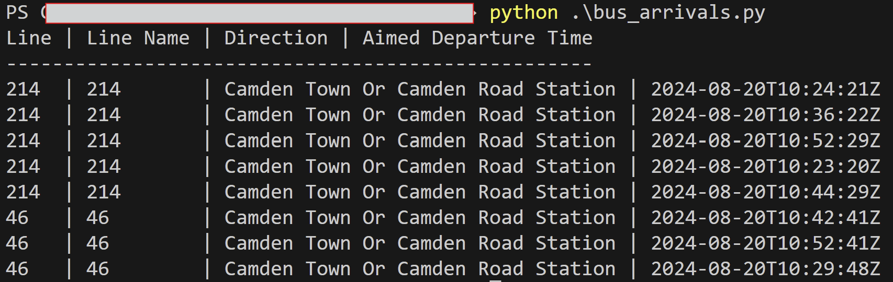
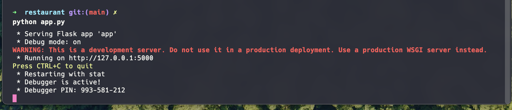

# DevOps Unit 3 Workshop

Welcome to the Unit 3 Workshop!

## Morning & Afternoon
### Our objectives
The objectives today are:

- Understand how to use an API by reading its documentation
- Interact with an API using command line and programming tools
- Understand the relationship between frontend websites and backend APIs
- Modify and augment an existing API

### Pre-flight checks
We're going to warm up the knowledge and skills we've developed in the eLearning modules about working with APIs.

Let's start by making a console application that reads out the next arrivals at a given bus stop.

This will warm up our muscles for understanding APIs, parsing documentation, working out which endpoints to use, and just getting a handle on APIs in general.

#### Step 1: Get the API key
APIs are sometimes paid, sometimes free. Some of the APIs that are free to use still require you to sign up for an account, so they can ensure the service is not being abused, and can provide fair service to everyone. 

The Transport for London (TfL) API is one such service! Let's get an account now, so we can get an API key. You can do this by:

- Visiting https://api.tfl.gov.uk/
- Clicking "Register" and "Register" again!
- Working through the "Sign Up" form & email verification

Once you sign in, visit the "Products" page and enter a new Product Subscription name. Sometimes, APIs give a key to a user, but sometimes they give API keys to individual apps. This means that if you had multiple apps using the same API, you could track how much each app was using the API, and shut down an API key for a misbehaving app without affecting the others.

Now you have created a subscription, it will show up under your Profile with a pair of `app_key`s. These are the keys you need to use the API. Can you think why they have provided a primary and a secondary?

API keys are intended to be kept secret - they're like passwords. If someone else gets a hold of your API key, they can masquerade as you while using a service. If they abuse the service in your name, you'll get in trouble. So protect these keys like you would passwords! 

Accordingly, we will avoid hardcoding API keys in our code - we don't want them to get committed to version control. 

There are other things we can do to get API keys into our code without putting them in the code itself. For example, we can store the `app_key` in files that are not committed to version control, and have our code read them in when we need them.

We're getting ahead of ourselves. Let's use the keys we have in the terminal before we worry about code.

#### Step 2: Finding the right endpoint
We have access to the TfL API. We just need to find the right endpoint to use. The documentation for the various APIs offered is here: https://api-portal.tfl.gov.uk/api-details

We're looking for an endpoint that will get us the next arrivals at a bus stop. We can worry about being able to let the user choose an arbitrary bus stop later. For now, let's just get the next arrivals at a bus stop with a known ID: `490012553B`.

> Hint: Bus stops are an example of a StopPoint in TfL jargon!

Once you've found the right endpoint, note the 4 pieces of information we look for in API documentation: the URL to hit, the request method, the parameters to pass in, and the format of the response.

#### Step 3: Using the API keys with the endpoint 
We're going to use the `curl` command to hit the API endpoint. This is a good time to also practice looking at documentation for tooling to figure out how to use them.

We've done curl requests in the past: a simple GET request looks like this:
```
curl https://www.example.com
```

But we will need to use the documentation for the API we want to use to find what URL to specify, the request method, and the parameters to pass in.
That could result in us needing to make a request that looks like this:
```
curl -X GET "https://api.tfl.gov.uk/some_endpoint?some_parameters"
```

You will need to join up the information from the API documentation with how to use the `curl` command.
The official curl documentation is here: https://curl.se/docs/manpage.html 
But there are also other resources, such as quick references or cheat sheets. For example, this one: https://devhints.io/curl

There's one more thing we need to do: since the TfL API requires authentication, we need to provide authentication parameters, as per the instructions (https://api-portal.tfl.gov.uk/) so provide the `app_key` as a query parameter. 

Once you've run your curl command, you should see a response from the API. It might be a bit of a mess, but it should be a mess that you can read!



You can see that the response is a JSON object that matches up to the documentation we read. This is a good sign that we're on the right track!

We can use the `jq` command to make the JSON response more readable. You probably have `jq` already on your machine (if you don't, you can install `jq` by following the instructions here: https://stedolan.github.io/jq/download/). Pipe to `jq` and you'll see the response in a more readable format:



#### Step 4: Making an equivalent Python application
Now that we're successfully working with the API in the terminal, let's make a Python application that does the same thing.

Create a new file called `bus-arrivals.py`, start with a simple print of "Hello World" to check everything is working, then get started with making your API request!

We can use the `requests` library to make HTTP requests in Python. The documentation for the `requests` library is here: https://docs.python-requests.org/en/master/

You can install the `requests` library by running `pip install requests` in your terminal. 

You can import the `requests` library in your Python code by adding `import requests` at the top of your Python file.

You can make a GET request in Python using the `requests.get` function. You can pass in the URL and any parameters as arguments to the function. All of this information and additional guidance is available in the Quickstart section of the documentation: https://docs.python-requests.org/en/latest/user/quickstart/

When you're done, you'll have a Python app that, once run, will output the next arrivals at the bus stop with ID `490012553B`. You can decide what format to output the information in! 

At its most basic, you could output the information in the same format as the JSON response you got from the API.

> Hint: you may want to use [the `json` method on the response](https://docs.python-requests.org/en/latest/user/quickstart/#json-response-content) to convert the response text into python data structures.



But you could also format it in a more human-readable way, or be a bit more adventurous by creating a little ASCII-art table!



#### Step 5: Expand your app
Once you've got the basic app working, you can expand it in a number of ways. For now, we'd like you to get your application to accept either a command line parameter, or ask for user input, in order to filter the results to only show buses for a certain route.
You can do that using `sys.argv`.
Here's an example of an application that accepts command line parameters, and outputs them back to the screen:

```
import sys

def main():
    if len(sys.argv) < 3:
        print("Usage: python script.py <argument1> <argument2> ...")
        sys.exit(1)
    
    # Print the script name
    print("Script name:", sys.argv[0])
    
    # Access and print each command line argument using array indexing
    print(f"Argument 1:", sys.argv[1])
    print(f"Argument 2:", sys.argv[2])

if __name__ == "__main__":
    main()
```

Now you have a Python application that interacts with a remote API, and takes input from users to process the results! Awesome work!

### Running an API and website, and understanding the relationship between them
Next, we're going to run a local API server, as well as a website that uses that underlying API for its operations and data.

#### Step 1: Running the API
If you haven't already, clone this repo to your machine. The application is under the "restaurant" directory.

You can run the application by:

1. Navigating to the "restaurant" directory (`cd restaurant/`)
2. Installing the necessary libraries by running `pip install -r requirements.txt`
3. Running the application by running `python app.py`

> If using ACG, you will need to install pip with `sudo apt install python3-pip`

You should see output that looks like this:



You should also be able to access the website by navigating to `http://localhost:5000` in your browser.

> If you're using ACG there are a couple of extra steps to access that - open the spoiler section below to work through those!

<details> <summary> Running the Flask app on ACloudGuru </summary>

If you're running the app on ACG, then we need to expose it to the internet so that you can connect from your machine. This involves two main steps:

1. Open a port in the firewall (we'll use `8000`) so that ACG doesn't block the site:
```
sudo ufw allow 8000
```

2. Run the site on the host `0.0.0.0` and on port 8000, by updating the final `app.run(..)` line in `app.py` to look like below:
```python
    app.run(debug=True, host = "0.0.0.0", port = 8000)
```

This is because by default the `localhost` address (`127.0.0.1`) isn't accessible to other machines. `0.0.0.0` by contrast tells Flask to be available to other machines in the network.

You can now try running the app with `python app.py` as before, and access the site at your server's IP: `http://<ip_here>:8000`.

</details>

------

#### Explore Flask

This API and website is powered by Flask. You can read more about Flask here: https://flask.palletsprojects.com/en/2.3.x/ - have a look at the Quickstart section to get a feel for how Flask applications are structured, and then compare it to the code in the "restaurant" directory! How does this website work? What does the code do? What are the other files, what are they for, and when are they used?

#### Step 2: Observing the booking behaviour
The website is a simple restaurant booking system. You can see the upcoming bookings, the upcoming dates, and you can make a reservation for a specific date. 

However, the restaurant doesn't allow bookings to be taken within the next 7 days. If you try to make a booking for a date within the next 7 days, you'll see an error message.

Try and make this booking, and see what happens!

#### Step 3: Booking anyway
You should now have satisfied yourself that the website will not allow you to make a booking within 7 days. However, we're going to make a booking anyway!

Without making any changes to the website code, we're going to make a booking for a date within the next 7 days. The reason this is possible is because there are two parts to the website: the frontend, which is what the user interacts with, and the backend, which is what the frontend interacts with.

The backend is the Flask application that you're running. The frontend is the HTML, CSS, and JavaScript that the user interacts with in their browser. 

Open up the Network tab in your browser, and watch what happens when you make a successful booking - the frontend sends a POST request to the backend, and the backend responds with a success message.

Does that sound familiar? It should! It's the same thing that happens when you interact with an API! In the same way that you just made a Python application that interacts with the TfL API, this is a website that uses Javascript to interact with the local API running with Flask.

With that in mind, keeping the Network tab open, try and make a booking for a date within the next 7 days. You might notice that unlike the successful booking, the failed booking doesn't actually send a request to the backend.

This is because the frontend is checking the date before it sends the request. If the frontend website thinks the date is invalid, it doesn't bother sending the request to the backend. 
As it happens, the backend doesn't check the date at all - it just assumes that the frontend has done its job. This is not good practice, even though it happens more often than you might think!

When the website performs a check like this, it's called "client-side validation". It's a good idea to do this, because it can save time and resources - if the user has made a mistake, there's no point in sending the request to the backend, because the backend will just reject it anyway.

However, it's also important to remember that the frontend is not secure. It's possible to manipulate the frontend to send requests that the frontend doesn't want to send. This is why it's important to have "server-side validation" as well - the backend should always check the data it receives, even if the frontend has already checked it.

Since our backend API doesn't check the date, we can make a booking for a date within the next 7 days by sending a request directly to the backend. This is just as easy as making a request to the TfL API!
Remember, the frontend is just a user of the API - it's not special, it's not magic. It's just another client, like the Python application you made earlier. So you can make a curl request to the backend, just like you did with the TfL API. 
As with other APIs, you'd be tempted to note the 4 pieces of information we look for in API documentation: the URL to hit, the request method, the parameters to pass in, and the format of the response. This is almost exactly what we're going to do, except that in this case we don't need the format of the response. 

Go to the Network tab, make a successful booking, and note the 3 pieces of information we do want. Note that one difference to the call we made earlier to the TfL API is that this time, we're going to need to send some data in the body of the request. Check the cheatsheet for curl to see how to do this!

Once you've made a successful booking using curl, you should see that the API responds with "Booking successful!". You can check that this has happened as you've expected by refreshing the web page and checking the list of upcoming bookings (and/or the calendar preview). 

You've now successfully made a booking for a date within the next 7 days, even though the website wouldn't let you!

### Fixing the issue
Now that you've successfully made a booking for a date within the next 7 days, you know that the website and API is not set up ideally. If it's this easy for you to make a booking for a date within the next 7 days, it's just as easy for anyone else to do the same thing! 

Let's fix this issue.

#### Step 1: Creating server-side validation
The issue arises because we're not checking the date on the backend. We're just assuming that the frontend has done its job. This is not good practice, because the frontend is not secure. Although this time we made a `curl` request to the backend, there are other methods available too - we can use the Developer Tools in the browser to manipulate the way the frontend website behaves (in the way that we previously changed the front page of the BBC News website earlier in the course).

The way to fix this issue is to add a check to the backend that ensures that the date is not within the next 7 days. If it is, the backend should reject the request.

You can do this by adding a check to the `app.py` file in the `restaurant` directory. You can check the date by using the `datetime` library in Python. You can read more about the `datetime` library here: https://docs.python.org/3/library/datetime.html

Or you can look at guides like these: 
- https://realpython.com/python-datetime/ 
- https://pythonmania.org/how-to-use-datetime-in-python/
- https://www.dataquest.io/blog/python-datetime/

#### Step 2: Testing the fix
Once you've added the check, try making the same `curl` request that attempts to book for a date within the next 7 days. The backend should reject the request, and the website should not display your attempted booking. 

You've now fixed the issue! Now you know how to use APIs, how to spot weaknesses, and how to resolve them!

## Stretch goals
### Stretch A: Bus arrivals as a web app
We just wrote a Python application that gets the next arrivals at a bus stop. We then modified that Python application to display the next arrivals at a bus stop, but only for a certain route specified by the user.

Now, instead of running this app in the terminal, let's have an app that runs a web server that can be visited by the browser. 

1. Create a new basic Flask app. Use the quickstart guide: https://flask.palletsprojects.com/en/2.3.x/quickstart/#
2. Much like the "A Minimal Application" example, you only need one route to be served, and that's `/`. Instead of returning "Hello, World!", return the next arrivals at a bus stop. This code will look very similar to the Python code you wrote earlier to get the next arrivals at a bus stop!
3. Test this API endpoint using `curl`. You should be able to make a `curl` request to your Flask app, and get back the next arrivals at a bus stop.
4. Test this API endpoint using a web browser. You should be able to visit your Flask app in a web browser, and see the next arrivals at a bus stop - this time you'll see it as plain text inside your browser window. It should remind you of the mad libs application we deployed in our very first workshop!

### Stretch B: Bus arrivals as a web app with user input
Since the original code you wrote to get the next arrivals at a bus stop allowed the user to specify a route, let's allow the user to specify a route in the web app as well!

Modify your web app so that the user can specify a route in the URL. For example, if the user visits `http://localhost:5000/123`, they should see the next arrivals at the bus stop with ID `490012553B`, but only for route `123`. You can see how to do this by reading the Flask documentation: https://flask.palletsprojects.com/en/2.3.x/quickstart/#variable-rules 


### Stretch C: Bus arrivals as a web app with user input and returning JSON instead of plaintext
We've been returning plaintext so far, but we are intending for this data endpoint to be an API, and APIs typically return JSON (or something else computer-readable). Do this by using the `jsonify` function in Flask. You can read more about it, or use the automatic conversion explained here: https://flask.palletsprojects.com/en/2.3.x/quickstart/#apis-with-json

### Stretch D: Bus arrivals as a HTML website
We've now built an API (in Flask) that itself uses another API (the TfL API) to get the next arrivals at a bus stop. 

We are now going to build a website that uses this Flask API we just made to display the next arrivals at a bus stop.

Here's how to approach it:
1. Get Flask to serve a basic HTML page when you visit the root URL. Read more of the Flask documentation, and also read the restaurant Flask code, and see if you can suss out how it works. If you need help with writing some HTML, try reading up on it using guides like this: https://developer.mozilla.org/en-US/docs/Learn/Getting_started_with_the_web/HTML_basics
2. Write some JavaScript to make a request to the Flask API we just made, and display the results using the `console.log` method. You can see how this is done by looking at the restaurant website code. You can read more about how to make requests in JavaScript here: https://developer.mozilla.org/en-US/docs/Web/API/Fetch_API/Using_Fetch - you may also wish to practice research and find more tutorials on the web to help you with this!
3. Get the JavaScript to display the results on the page. You can do this by modifying the DOM. You can read more about how to do this here: https://developer.mozilla.org/en-US/docs/Web/API/Document_Object_Model/Introduction or you may wish to look for more guidance on the internet, and don't forget to read the restaurant website code to see how it's done there!

### Stretch E: Further improvements to the website
You now have: 
- A Flask API that gets the next arrivals at a bus stop
- A website that uses this API to display the next arrivals at a bus stop

But you could go so much further! Here are some ideas:
- Make the website more functional: Use more of the TfL API's endpoints to get more done - maybe get the user to supply their latitude and longitude, so that you can get the nearest bus stop to them, and then get the next arrivals at that bus stop! Or use the Postcodes API, and ask the user for their postcode instead of a latitude and longitude!
- Make the website look nicer: You can do this by using CSS. You can read more about CSS here: https://developer.mozilla.org/en-US/docs/Learn/CSS/First_steps
- Make the website more interactive: You can do this by using JavaScript. You can read more about JavaScript here: https://developer.mozilla.org/en-US/docs/Learn/JavaScript/First_steps

### Stretch F: Further experiments in server-side web security
We've just seen how easy it is to manipulate the frontend of a website to send requests that the frontend doesn't want to send. This is a common problem in web development, and it's why it's important to have server-side validation as well as client-side validation. 

There are many different ways in which web infrastructure can be targeted, and it's useful to be aware of them. If you find this topic interesting, you can try out this security game and see how far you get: https://overthewire.org/wargames/natas/
