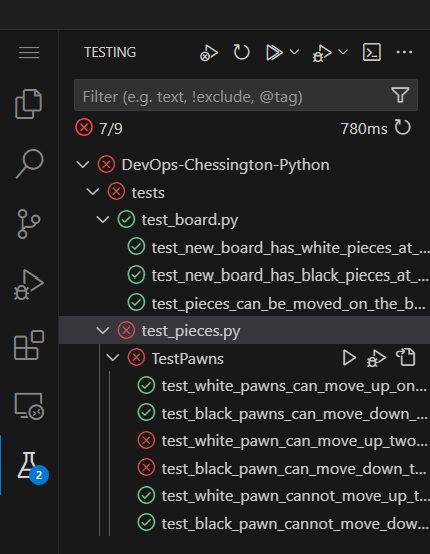

# Chessington

Starter project for a chess-based TDD exercise.

## Getting the application up and running

### Installing dependencies
First, let's ensure that you have installed python and pip on your system. 

- Run `python --version` and you should see a version number. If not, you may need to install Python on your machine. On ACG, this should be already available - ensure you're using the image specified in the instructions.
    - You should also check that [the Python VSCode Extension](https://marketplace.visualstudio.com/items?itemName=ms-python.python) is installed
- Run `pip --version` and you should also see a version number. If not, you may need to install pip on your machine. On ACG, you can do `sudo apt install python3-pip` to install pip.

After that, install dependencies using the command `pip install -r requirements.txt`. 
_If you are working on your work/own machine, and you are already familiar with using virtual environments to help manage your dependencies, feel free to follow your usual routine and create a virtual environment for this, installing the dependencies inside it._

### Running the application

- To run the application, use the command `python -m flask run --host 0.0.0.0 --port 8000`.
- If you are running the app on your local machine, you can now navigate to `http://localhost:8000` in your browser to see the chess board.
- If you are running on ACG, you will see a popup to open a tunnel to port `8000` on the host (this can also be configured from the "Remote Explorer" icon on the left hand side or the "PORTS" tab in the terminal window)
- You can reset the board at any time by restarting the server.

Clicking on one of the white pieces will highlight the square that piece is on, and also show you the squares it can move to. Except...

None of the rules of chess have been implemented yet! That's your job :)

## Running the tests

To run the tests, use the command `python -m pytest tests`. This will search the "tests" directory for files starting in `test_` or ending in `_test`. Inside those files, any function starting with `test_` will be considered a test.

You can also run test invidually from VS Code's built-in test window (by clicking the "beaker" icon in VS Code):

## Debugging

Debugging the tests can be managed from the Testing Window (shown in the image above).

Debugging the application can be managed by clicking the Run & Debug icon in VS Code (note you should not already have the program running for this to work!).

## During the Workshop

Once you have the app and tests running start on the [workshop instructions](./during_the_workshop.md).
